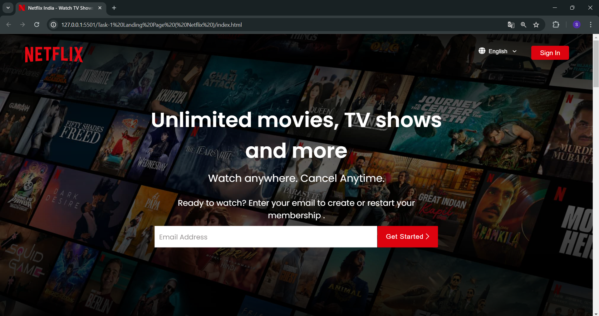

# Netflix Clone Landing Page

Welcome to the Netflix Clone Landing Page repository! This project is a recreation of the Netflix landing page to showcase HTML, CSS, and possibly JavaScript skills.

## Screenshots

## Description

This project aims to replicate the user interface and design of the Netflix landing page. It includes sections such as a hero banner, featured content, categories, and a footer. The purpose is to demonstrate proficiency in front-end web development technologies and to provide a platform for learning and experimentation.

## Features

- Responsive design: The landing page is designed to adapt to different screen sizes and devices, providing a seamless user experience across desktops, tablets, and mobile phones.
- Interactive elements: Some interactive elements may be included, such as hover effects, carousel sliders, or modal windows, to enhance user engagement.
- Custom styling: The page may use custom CSS to match the visual appearance of the original Netflix landing page as closely as possible.
- Placeholder content: Placeholder images and text may be used to mimic the appearance of actual Netflix content.

## Technologies Used

- HTML5: Markup language for structuring the content of the web page.
- CSS3: Styling language used to define the layout, colors, and typography of the page.
- JavaScript (optional): Used to add interactivity and dynamic behavior to the page.
- Git: Version control system for tracking changes to the project files.
- GitHub Pages: Hosting service for deploying the landing page and making it accessible online.

## Contributing

Contributions are welcome! If you'd like to contribute to the project, feel free to fork the repository, make your changes, and submit a pull request. Please follow the existing coding style and conventions, and provide a clear description of the changes you've made.
